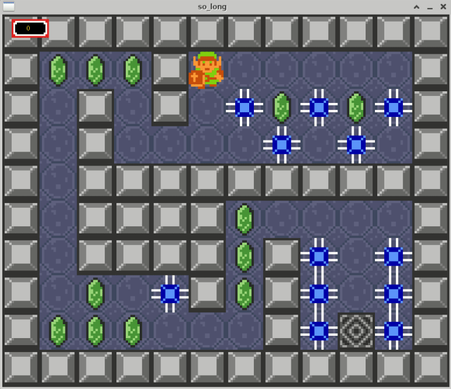

# so_long
The first computer graphics project at
[42](https://www.42sp.org.br/). A simple but charming 2D game.

## Preview


## What is so_long
It's a very small 2D Game. It's purpose is to make you work with textures,
sprites and some very basic gameplay elements using
[MinilibX](https://github.com/42Paris/minilibx-linux),
a simplified X-Window API in C designed for students.

To run the game, you must pass a map file in the ```.ber``` format as an
argument. The map must contain only the following characters:
- 1: Wall
- 0: Floor
- P: Player starting point
- C: Collectible
- E: Exit
- X: Enemy (Bonus only)

The player must gather all the coins before being able to exit the level!

## How to install the dependencies

### Linux and MacOS
Please follow the instructions from
[MinilibX](https://github.com/42Paris/minilibx-linux) in order to install the
necessary dependencies.

### Windows
You can either use WSL2 or manually install Xserver in your machine.

## How to run the game
```bash
git clone https://github.com/bru-correa/42_so_long
make run_bonus
```
You can also create your own maps and run then:
```bash
./so_long_bonus path/to/your_map.ber
```
